# nf-gwas: Nextflow GWAS Pipeline

## Project Vision

**nf-gwas** is a comprehensive Nextflow-based pipeline for genetic analysis, enabling researchers to perform three primary types of analyses:

### 1. **Association Analysis**
Identify genetic variants associated with traits or diseases using:
- **REGENIE**: Two-step whole genome regression for large biobank-scale datasets
- **GCTA FastGWA**: Fast mixed model association testing for biobank-scale data

### 2. **Heritability Estimation**
Quantify the proportion of phenotypic variance explained by genetic factors:
- **Individual-level data**: GCTA GREML, BOLT-LMM REML, LDAK REML/HE/PCGC
- **Summary statistics**: LDAK SumHer
- Supports both quantitative and binary traits (liability-scale heritability)

### 3. **Genetic Correlation**
Estimate shared genetic architecture between traits:
- **LDAK SumCors**: Genetic correlation from GWAS summary statistics
- **GCTA bivariate GREML**: Genetic correlation from individual-level data

**For detailed workflow mapping and use case guides**, see [docs/ANALYSIS_TYPES.md](docs/ANALYSIS_TYPES.md).

---

## Architecture Overview

### Technology Stack
- **Workflow Engine**: Nextflow DSL2 (requires >=22.10.4)
- **Containerization**: Docker, Singularity
- **Statistical Tools**: REGENIE v3.4, GCTA, LDAK6, BOLT-LMM, PLINK1.9/2.0
- **Languages**: Groovy (workflow logic), R (statistics/plotting), Java (utilities), Bash (process scripts)
- **Testing Framework**: nf-test

### High-Level Data Flow

```
Input Data (VCF/PLINK) → Data Conversion → Analysis Workflows → Results
                              ↓
                         Quality Control
                              ↓
                    [Association | Heritability | Genetic Correlation]
                              ↓
                    Output (Statistics, Plots, Reports)
```

**For analysis-specific data flows**, see [docs/ANALYSIS_TYPES.md](docs/ANALYSIS_TYPES.md#analysis-specific-data-flows).

---

## Module Structure

```mermaid
graph TD
    A["(Root) nf-gwas"] --> B["workflows/"];
    A --> C["modules/local/"];
    A --> D["bin/"];
    A --> E["conf/"];
    A --> F["tests/"];
    A --> G["lib/"];
    A --> H["docs/"];

    B --> B1["regenie/"];
    B --> B2["gcta/"];
    B --> B3["ldak/"];
    B --> B4["bolt_lmm/"];
    B --> B5["single_variant_tests.nf"];
    B --> B6["nf_gwas.nf"];

    C --> C1["regenie/"];
    C --> C2["gcta/"];
    C --> C3["ldak/"];
    C --> C4["bolt_lmm/"];

    H --> H1["ANALYSIS_TYPES.md"];
    H --> H2["CODING_STANDARDS.md"];
    H --> H3["AI_GUIDELINES.md"];

    click B1 "./workflows/regenie/CLAUDE.md"
    click B2 "./workflows/gcta/CLAUDE.md"
    click B3 "./workflows/ldak/CLAUDE.md"
    click B4 "./workflows/bolt_lmm/CLAUDE.md"
    click C1 "./modules/local/regenie/CLAUDE.md"
    click C2 "./modules/local/gcta/CLAUDE.md"
    click C3 "./modules/local/ldak/CLAUDE.md"
    click D "./bin/CLAUDE.md"
    click E "./conf/CLAUDE.md"
    click F "./tests/CLAUDE.md"
    click G "./lib/CLAUDE.md"
    click H1 "./docs/ANALYSIS_TYPES.md"
    click H2 "./docs/CODING_STANDARDS.md"
    click H3 "./docs/AI_GUIDELINES.md"
```



---

## Module Index

Comprehensive index of all pipeline components organized by function.

| Module Path | Responsibility | Language | Entry Points |
|-------------|---------------|----------|--------------|
| `workflows/` | Main workflow orchestration | Nextflow | `nf_gwas.nf`, `single_variant_tests.nf` |
| `workflows/regenie/` | REGENIE two-step GWAS workflow orchestration | Nextflow | `regenie.nf`, `regenie_step1.nf`, `regenie_step2.nf` |
| `workflows/gcta/` | GCTA GRM calculation and GREML analysis | Nextflow | `gcta_grm.nf`, `gcta_greml.nf`, `gcta_greml_ldms.nf`, `gcta_fastgwa.nf` |
| `workflows/ldak/` | LDAK kinship and heritability workflows | Nextflow | `ldak.nf`, `ldak_qc.nf`, `calc_kins.nf`, `ldak_he.nf`, `ldak_pcgc.nf`, `ldak_sumher.nf`, `ldak_sumcors.nf` |
| `workflows/bolt_lmm/` | BOLT-LMM mixed model analysis | Nextflow | `bolt_lmm_reml.nf` |
| `modules/local/regenie/` | REGENIE process modules (Step 1 & 2) | Nextflow | `regenie_step1_run.nf`, `regenie_step2_run.nf`, chunking/merging modules |
| `modules/local/gcta/` | GCTA utility processes (GRM, REML, LD scores) | Nextflow | `make_grm_part.nf`, `run_reml.nf`, `calculate_ld_scores.nf` |
| `modules/local/ldak/` | LDAK kinship and weighting processes | Nextflow | `calc_kins_*.nf`, `ldak_reml.nf`, `ldak_pcgc.nf`, `calc_inflation.nf` |
| `bin/` | Utility scripts for parsing, validation, statistics | R, Java | `RegenieLogParser.java`, `calc_inflation.R`, `segment_snp.R` |
| `conf/` | Pipeline configuration profiles and resource definitions | Nextflow Config | `base.config`, `test.config` |
| `lib/` | Groovy helper libraries | Groovy | `WorkflowMain.groovy`, `RegenieUtil.groovy` |
| `tests/` | nf-test framework tests and test data | nf-test | `main.nf.test`, `modules/local/*.nf.test` |
| `docs/` | Extended documentation | Markdown | `ANALYSIS_TYPES.md`, `CODING_STANDARDS.md`, `AI_GUIDELINES.md` |

---

## Quick Start

### Prerequisites
- Nextflow >=22.10.4
- Docker or Singularity
- (Optional) SLURM scheduler for HPC execution

### Installation

```bash
# Clone repository
git clone https://github.com/genepi/nf-gwas
cd nf-gwas

# Build Singularity container (if not using Docker)
singularity build nf-gwas.sif nf-gwas.def

# Run test profile with Singularity (currently runs LDAK QC workflow)
nextflow run main.nf -profile test,singularity
```

### Development and Testing

For development and testing workflows, use the **singularity profile with development/test profiles**:

```bash
# Development mode with resume enabled + Singularity (custom data)
nextflow run main.nf -profile development,singularity --genotypes_prediction ... --phenotypes_filename ...

# Single development run with test data + resume
nextflow run main.nf -profile test,development,singularity

# Quick test with test data (no resume)
nextflow run main.nf -profile test,singularity
```

This ensures you're using containerized, reproducible environments during development and testing.

### Running Specific Analysis Types

**Association Analysis (on HPC):**
```bash
nextflow run main.nf \
    --run_association_analysis true \
    --genotypes_association_vcf "data/chr*.vcf.gz" \
    --genotypes_prediction "data/genotypes.{bed,bim,fam}" \
    --phenotypes_filename phenotypes.txt \
    --phenotypes_columns trait1,trait2 \
    -profile slurm,singularity
```

**Heritability Estimation (LDAK HE - Fast, local development):**
```bash
nextflow run main.nf \
    --run_heritability_estimation true \
    --heritability_method ldak_he \
    --genotypes_association_vcf "data/chr*.vcf.gz" \
    --phenotypes_filename phenotypes.txt \
    --phenotypes_columns height \
    -profile development,singularity
```

**Heritability Estimation (GCTA GREML - Gold Standard, on HPC):**
```bash
nextflow run main.nf \
    --run_heritability_estimation true \
    --heritability_method gcta_greml \
    --genotypes_association_vcf "data/chr*.vcf.gz" \
    --phenotypes_filename phenotypes.txt \
    --phenotypes_columns height \
    -profile slurm,singularity
```

**Using PLINK1 Files Directly (skip VCF conversion):**
```bash
nextflow run main.nf \
    --run_heritability_estimation true \
    --heritability_method ldak_he \
    --genotypes_association_plink1 "data/chr*.{bed,bim,fam}" \
    --phenotypes_filename phenotypes.txt \
    --phenotypes_columns height \
    -profile singularity
```

**Using PLINK2 Files Directly (skip VCF conversion):**
```bash
nextflow run main.nf \
    --run_heritability_estimation true \
    --heritability_method gcta_greml \
    --genotypes_association_plink2 "data/chr*.{pgen,psam,pvar}" \
    --phenotypes_filename phenotypes.txt \
    --phenotypes_columns height \
    -profile singularity
```

**Using Both PLINK1 and PLINK2 (no conversions):**
```bash
nextflow run main.nf \
    --run_heritability_estimation true \
    --heritability_method gcta_greml_ldms \
    --genotypes_association_plink1 "data/chr*.{bed,bim,fam}" \
    --genotypes_association_plink2 "data/chr*.{pgen,psam,pvar}" \
    --phenotypes_filename phenotypes.txt \
    --phenotypes_columns height \
    -profile singularity
```

**Genetic Correlation (SumCors):**
```bash
nextflow run main.nf \
    --run_genetic_correlation true \
    --genetic_correlation_method ldak_sumcors \
    --ldak_sumcors_summary_stats1 trait1_gwas.txt \
    --ldak_sumcors_summary_stats2 trait2_gwas.txt \
    --ldak_sumcors_tagfile tagging_file.tagging \
    -profile singularity
```

**For complete usage examples and analysis type selection guide**, see [docs/ANALYSIS_TYPES.md](docs/ANALYSIS_TYPES.md).

---

## Execution Profiles

Profiles are **independent and composable**. Combine them as needed for your execution environment.

### Execution Profiles
| Profile | Purpose | Effect |
|---------|---------|--------|
| `test` | Quick testing | Runs with example test data (use with `-profile test,singularity`) |
| `development` | Development mode | Enables resume for iterative development |
| `slurm` | HPC cluster execution | Sets executor to SLURM |
| `slurm_with_scratch` | HPC with scratch space | Sets executor to SLURM with temporary scratch |

### Containerization Profiles
| Profile | Container | Effect |
|---------|-----------|--------|
| `singularity` | `nf-gwas.sif` | Singularity containerization with autoMounts |
| `docker` | Docker | Docker containerization |

### Debug Profile
| Profile | Purpose |
|---------|---------|
| `debug` | Debugging | Prints hostname before each process |

### Recommended Combinations

**Local Development:**
```bash
nextflow run main.nf -profile development,singularity [options]
```

**Testing:**
```bash
nextflow run main.nf -profile test,singularity
```

**HPC with Singularity:**
```bash
nextflow run main.nf -profile slurm,singularity [options]
```

**HPC with Scratch Space:**
```bash
nextflow run main.nf -profile slurm_with_scratch,singularity [options]
```

---

## Key Parameters

**Required:**
- `--project`: Project name
- `--phenotypes_filename`: Phenotype file path
- `--phenotypes_columns`: Comma-separated phenotype column names
- At least one genotype input (see below)

**Genotype Input Parameters (supply any combination):**
- `--genotypes_association_vcf`: VCF files (e.g., `"data/chr*.vcf.gz"`)
- `--genotypes_association_plink1`: PLINK1 files (e.g., `"data/chr*.{bed,bim,fam}"`)
- `--genotypes_association_plink2`: PLINK2 files (e.g., `"data/chr*.{pgen,psam,pvar}"`)
- `--genotypes_prediction`: PLINK files for prediction (Step 1)

**Conversion Logic:**
| Supplied | PLINK1 Source | PLINK2 Source | Conversions |
|----------|---------------|---------------|-------------|
| VCF only | Converted | Converted | 2 conversions |
| PLINK1 only | Direct | Converted | 1 conversion |
| PLINK2 only | Converted | Direct | 1 conversion |
| PLINK1 + PLINK2 | Direct | Direct | **No conversions** |
| VCF + PLINK1 | Direct | Converted | 1 conversion |
| VCF + PLINK2 | Converted | Direct | 1 conversion |
| All three | Direct | Direct | **No conversions** |

**Optional:**
- `--covariates_filename`: Covariate file path
- `--regenie_test`: Test type (additive/recessive/dominant)
- `--regenie_run_gene_based_tests`: Enable gene-based testing
- `--nparts_gcta`: Number of GRM calculation chunks (default: 10)
- `--ldak_use_he_regression`: Enable fast HE regression
- `--ldak_run_pcgc`: Enable PCGC for binary traits
- `--ldak_pcgc_prevalence`: Disease prevalence (required for PCGC)

See `nextflow_schema.json` for complete parameter documentation.

---

## Testing

### Running Tests

```bash
# Run all tests
nf-test test

# Run specific module test
nf-test test tests/modules/local/regenie_step1.nf.test

# Run main workflow test
nf-test test tests/main.nf.test
```

### Test Coverage
- REGENIE Step 1 & 2 (standard and chunked modes)
- GCTA GRM creation and GREML
- LDAK kinship, HE, PCGC, and QC workflows
- VCF to PLINK conversion
- Result filtering and reporting

**Note**: Test data (N=500) validates workflow functionality, not method performance on large datasets.

For detailed testing documentation, see [tests/CLAUDE.md](tests/CLAUDE.md).

---

## Development Guidelines

### Coding Standards
**For complete coding standards**, see [docs/CODING_STANDARDS.md](docs/CODING_STANDARDS.md).

**Quick Reference:**
- Use Nextflow DSL2 syntax
- Follow process isolation principles
- Use descriptive channel naming (`_ch`, `_file`, `_list`)
- Implement retry strategies with resource scaling
- Use standard resource labels (`process_low`, `process_medium`, `process_high`)

### AI Assistance
**For comprehensive AI usage guidelines**, see [docs/AI_GUIDELINES.md](docs/AI_GUIDELINES.md).

**Best Practices:**
1. Reference CLAUDE.md documentation first
2. Provide minimal reproducible examples
3. Include Nextflow version and execution profile
4. Validate AI suggestions before implementing
5. Update documentation after resolving issues

**LDAK-Specific**: For LDAK theory and methods, consult the **LDAK skill** documentation.

---

## Project Structure Summary

```
nf-gwas-new/
├── main.nf                    # Pipeline entry point
├── nextflow.config            # Global configuration
├── nextflow_schema.json       # Parameter schema/validation
├── nf-gwas.def                # Singularity definition
├── workflows/                 # Workflow logic
│   ├── nf_gwas.nf             # Main workflow orchestrator
│   ├── regenie/               # REGENIE workflows (3 files)
│   ├── gcta/                  # GCTA workflows (4 files)
│   ├── ldak/                  # LDAK workflows (7 files)
│   └── bolt_lmm/              # BOLT-LMM workflows (1 file)
├── modules/local/             # Process definitions
│   ├── regenie/               # REGENIE processes (6 files)
│   ├── gcta/                  # GCTA processes (15 files)
│   ├── ldak/                  # LDAK processes (16 files)
│   └── bolt_lmm/              # BOLT-LMM processes (1 file)
├── bin/                       # Utility scripts (5 files)
├── lib/                       # Groovy libraries (2 files)
├── conf/                      # Configuration files (2 files)
├── tests/                     # Test suite
│   ├── main.nf.test           # Main workflow test
│   ├── modules/local/         # Module-level tests (13 files)
│   └── input/                 # Test data
└── docs/                      # Extended documentation
    ├── ANALYSIS_TYPES.md      # Workflow mapping and use case guide
    ├── CODING_STANDARDS.md    # Development best practices
    └── AI_GUIDELINES.md       # AI assistance guidelines
```

---

# Coding Standards

Best practices and conventions for nf-gwas pipeline development.

[Root Documentation](../CLAUDE.md)

---

## Development Prerequisites

### Context7 Integration
**REQUIRED**: When implementing new code or modifying existing code including when writing tests, Claude must use Context7 to retrieve up-to-date documentation, API references, and best practices for the libraries and tools being used. This ensures code quality and adherence to current standards.

---

## Nextflow Best Practices

### 1. DSL2 Syntax
All workflows use `nextflow.enable.dsl=2`

### 2. Process Isolation
Each process is self-contained with explicit inputs/outputs

### 3. Channel Naming Conventions
Use descriptive suffixes:
- `_ch` for channels
- `_file` for single files
- `_list` for collections

**Examples:**
```groovy
imputed_files_ch
phenotypes_file
genotype_list
```

### 4. Handling Optional Inputs (Ternary File Pattern)

**REQUIRED**: Use the "Ternary File" pattern for optional file inputs. Never use `file("NO_FILE")` or similar placeholder patterns.

**Workflow Level** - Resolve optional params to `[]` (empty list):
```groovy
workflow {
    // ✅ CORRECT: Use empty list [] for missing optional files
    covariates_file = params.covariates_filename
        ? file(params.covariates_filename, checkIfExists: true)
        : []

    // ❌ WRONG: Never use placeholder file names
    // covariates_file = params.covariates_filename
    //     ? file(params.covariates_filename)
    //     : file("NO_FILE")

    PROCESS(data_ch, covariates_file)
}
```

**Process Level** - Use truthy check for optional inputs:
```groovy
process EXAMPLE_PROCESS {
    input:
    path data_file
    path optional_file  // May be [] (empty list)

    script:
    // ✅ CORRECT: Simple truthy check
    def optional_param = optional_file ? "--option ${optional_file}" : ''

    // ❌ WRONG: Never check for placeholder file names
    // def optional_param = optional_file && !optional_file.name.startsWith('NO_FILE')
    //     ? "--option ${optional_file}" : ''

    """
    command --input ${data_file} ${optional_param}
    """
}
```

**Test Files** - Pass `[]` for optional inputs:
```groovy
test("Should work without optional input") {
    when {
        process {
            """
            input[0] = file("test_data.txt")
            input[1] = []  // No optional file (empty list)
            """
        }
    }
    // ...
}
```

**Why this pattern is required:**
1. **Cleaner semantics**: `[]` clearly represents "nothing"
2. **Simpler checks**: `if (file)` vs. `if (!file.name.startsWith('NO_FILE'))`
3. **No stub files**: Eliminates need for placeholder files in test data
4. **Standard Nextflow pattern**: Follows recommended best practices

---

## Process Design Patterns

### Standard Process Template
```groovy
process EXAMPLE_PROCESS {
    tag "meaningful_identifier"           // For logging
    publishDir "${params.pubDir}/subdir", // Output location
               mode: 'copy',
               pattern: '*.output'

    label 'process_medium'                // Resource allocation

    input:
    tuple val(id), path(input_file)      // Structured inputs

    output:
    path "output_*", emit: result        // Named outputs

    script:
    """
    command --input ${input_file} \\
            --threads ${task.cpus} \\
            --output output_${id}
    """
}
```

### Key Elements

**1. Tag Directive**
- Provides meaningful process identifiers in logs
- Use variables to make each execution unique
- Example: `tag "${phenotype}_chr${chr_num}"`

**2. PublishDir**
- Define output destination
- Use `mode: 'copy'` for results (not symlinks)
- Use `pattern` to filter specific outputs
- Example: `pattern: '*.{regenie,log}'`

**3. Input Tuples**
- Group related data: `tuple val(id), path(file)`
- Maintains data association through pipeline
- Example: `tuple val(chr_num), val(filename), path(bed), path(bim), path(fam)`

**4. Named Outputs**
- Use `emit:` for clarity in workflows
- Example: `path "results.txt", emit: results`

**5. Script Block**
- Use multi-line strings with `"""`
- Escape line continuations with `\\`
- Reference task resources: `${task.cpus}`, `${task.memory}`

---

## Groovy Library Standards

### File Organization
- Place reusable logic in `lib/`
- Use static methods for utility functions
- Keep libraries focused (single responsibility)

### Code Style
```groovy
class WorkflowMain {
    // Use static for stateless utilities
    public static void validateParams(Map params) {
        // Validation logic
    }

    // Document public methods
    /**
     * Validates input file paths
     * @param files List of file paths
     * @return List of validated file objects
     */
    public static List<File> validateFiles(List<String> files) {
        // Implementation
    }
}
```

---

## R Script Standards

### Shebang and Arguments
```R
#!/usr/bin/env Rscript

# Parse command-line arguments
args <- commandArgs(trailingOnly = TRUE)
if (length(args) < 3) {
    stop("Usage: script.R <input> <output> <param>")
}

input_file <- args[1]
output_file <- args[2]
param <- as.numeric(args[3])
```

### File I/O
- Use `data.table::fread()` for fast reading
- Use `readr::write_tsv()` for writing
- Output results to files (not stdout for large datasets)

### Error Handling
```R
if (!file.exists(input_file)) {
    stop(sprintf("Input file not found: %s", input_file))
}

tryCatch({
    # Processing code
}, error = function(e) {
    cat("ERROR:", e$message, "\n", file = stderr())
    quit(status = 1)
})
```

---

## Java Utility Standards

### jbang Headers
```java
///usr/bin/env jbang "$0" "$@" ; exit $?

import java.io.*;
import java.nio.file.*;

public class UtilityScript {
    public static void main(String[] args) {
        // Implementation
    }
}
```

### Best Practices
- Use jbang-compatible single-file scripts
- Keep dependencies minimal
- Provide clear error messages
- Exit with appropriate status codes (0 = success, 1 = error)

---

## Testing Standards

### nf-test Structure
```groovy
nextflow_process {
    name "TEST_PROCESS_NAME"
    script "path/to/process.nf"
    process "PROCESS_NAME"

    test("Descriptive test case name") {
        when {
            process {
                """
                input[0] = channel.of([...])
                input[1] = file("test_data.txt")
                """
            }
        }

        then {
            assert process.success
            assert snapshot(process.out).match()
        }
    }
}
```

### Test Data Requirements
- Keep test data minimal (<50 MB total)
- Use realistic but small datasets (N=500 samples)
- Commit test data to repository
- Document test data provenance

### Snapshot Management
- Update snapshots intentionally: `nf-test test --update-snapshot`
- Review snapshot changes in PRs
- Document why snapshots changed

---

## Git Workflow Standards

### Commit Messages
Follow conventional commit format:
```
<type>(<scope>): <subject>

<body>

<footer>
```

**Types:**
- `feat`: New feature
- `fix`: Bug fix
- `refactor`: Code refactoring
- `docs`: Documentation changes
- `test`: Test additions/modifications
- `chore`: Maintenance tasks

**Examples:**
```
feat(ldak): add PCGC regression for binary traits

Implemented LDAK PCGC workflow for liability-scale heritability
estimation in case-control studies.

Closes #42
```

### Branch Naming
- `feature/<description>` - New features
- `fix/<description>` - Bug fixes
- `refactor/<description>` - Code refactoring

---

## Documentation Standards

### CLAUDE.md Structure
Each module directory should have:

```markdown
# Module Name

[Root Directory](../../CLAUDE.md) > **module**

## Change Log (Changelog)

### YYYY-MM-DD
- Change description

---

## Module Responsibilities
Description of what this module does

---

## [Additional sections as needed]

---

## Related Documentation
Links to related docs
```

### Code Comments
- Use comments sparingly (prefer self-documenting code)
- Explain *why*, not *what*
- Document complex algorithms
- Use docstrings for public functions/classes

**Good:**
```groovy
// Remove related individuals (kinship > 0.354) to avoid bias in REML
process FILTER_RELATEDNESS {
    ...
}
```

**Bad:**
```groovy
// Filter relatedness
process FILTER_RELATEDNESS {
    ...
}
```

---

## Performance Optimization

### Parallelization Strategies

**1. Chromosome-level Parallelization**
```groovy
imputed_files_ch
    .map { file -> ... }
    .set { chr_specific_ch }

PROCESS(chr_specific_ch)  // Automatic parallel execution
```

**2. Explicit Parallelization**
```groovy
genotype_list
    .splitText(by: 100)
    .set { chunks_ch }

PROCESS_CHUNKS(chunks_ch)
```

**3. Resource-aware Execution**
- Use `task.cpus` in commands
- Set appropriate `maxForks` in config
- Balance memory vs. CPU allocation

### File I/O Optimization
- Use channels efficiently (avoid unnecessary file reads)
- Compress intermediate files when large
- Use `.collect()` sparingly (memory implications)

---

## Container Best Practices

### Singularity Definition
```singularity
Bootstrap: docker
From: condaforge/mambaforge:latest

%files
    environment.yml /tmp/environment.yml

%post
    mamba env create -f /tmp/environment.yml -p /opt/conda
    mamba clean -afy

%environment
    export PATH="/opt/conda/bin:$PATH"
```

### Dependency Management
- Pin software versions in `environment.yml`
- Document version compatibility
- Test containers before deploying

---

## Related Documentation

- [Root Documentation](../CLAUDE.md)
- [Module Index](../modules/local/CLAUDE.md)
- [Workflow Documentation](../workflows/CLAUDE.md)
- [Testing Documentation](../tests/CLAUDE.md)


## Documentation Index

### Core Documentation
- **This file (CLAUDE.md)**: High-level overview, quick start, module index
- **[ANALYSIS_TYPES.md](docs/ANALYSIS_TYPES.md)**: Detailed workflow mapping for 3 analysis types
- **[CODING_STANDARDS.md](docs/CODING_STANDARDS.md)**: Development best practices and conventions
- **[AI_GUIDELINES.md](docs/AI_GUIDELINES.md)**: AI assistance guidelines and best practices

### Module-Specific Documentation
- [Workflows Overview](./workflows/CLAUDE.md)
- [REGENIE Workflows](./workflows/regenie/CLAUDE.md)
- [GCTA Workflows](./workflows/gcta/CLAUDE.md)
- [LDAK Workflows](./workflows/ldak/CLAUDE.md)
- [BOLT-LMM Workflows](./workflows/bolt_lmm/CLAUDE.md)
- [REGENIE Modules](./modules/local/regenie/CLAUDE.md)
- [GCTA Modules](./modules/local/gcta/CLAUDE.md)
- [LDAK Modules](./modules/local/ldak/CLAUDE.md)
- [Configuration Guide](./conf/CLAUDE.md)
- [Testing Documentation](./tests/CLAUDE.md)
- [Utility Scripts](./bin/CLAUDE.md)
- [Library Functions](./lib/CLAUDE.md)

